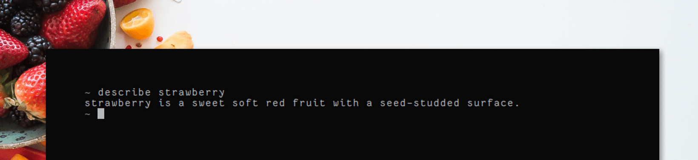

>Query words from oxford dictionaries API

## Usage

[](https://asciinema.org/a/nLvdaH3DTSVgfgPMYRsW5av1b)

To query for a words definition simply pass it as an argument to the script

```bash
$ describe tiny

tiny is very small
```

Alternatively, you can try deriving the words meaning by its synonyms

```bash
$ describe --synonyms tiny

minute
small-scale
scaled-down
mini
baby
toy
pocket
fun-size
petite
dwarfish
knee-high
miniature
minuscule
microscopic
nanoscopic
infinitesimal
micro
diminutive
pocket-sized
reduced
Lilliputian
```

or its antonyms

```bash
$ describe --antonyms tiny

huge
significant
```


## Installation

```bash
$ git clone https://github.com/pavanjadhaw/describe

$ cd describe

$ npm install
$ npm link
```

In order to make the script work you first have to register a (free) developer account at [Oxford Dictionaries](https://developer.oxforddictionaries.com/) to obtain an `app id` and `app key` and put them in config.js


## Requirements

`nodejs`
`npm`
